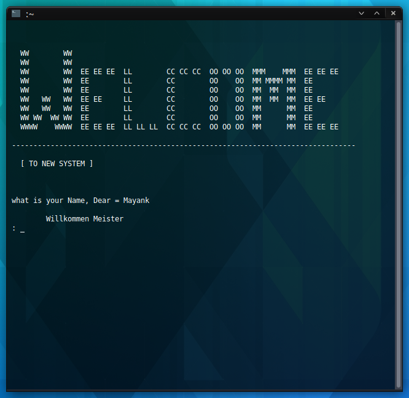

# HalloFriend

- Name : "HalloFriend"

- Description : "Python CUI friend bot for just enjoy"

- Version : 2.0

- Update : 05-05-2024

- Status : REST

- Interface : CUI

- TecStack : { Python }

- Thanks : { VSCodium | GitHub | Python }

- Work : Self

- Developer : { Mayank }

- CopyRight : { Mayank }

---

#### Project Look & Feel




#### Key Feature that make program more valuble

 - [x] Plathform Independent
 - [x] CUI application
 - [x] Simple to use
 - [ ] Functionality

#### Requirement to use

-  Donwload

   <https://github.com/MayankDevil/HalloFriend/archive/refs/heads/main.zip>
   
-  Install python3
   
-  Get open Terminal in project folder

-  Interpret script

```sh
python3 main.py
```

- For close use CTRL+C else GUI


### Warning

** Copyright (C) by Mayank. All Right Reserved **

__" Please refrain from unauthorized coping or downloading of content, as such actions are subject to legal consequences and potential charges.We encourage respectful and responsible use of the resouces provided for learning purpose."__

[](https://github.com/MayankDevil/)


<!--
Was kann ich für Sie tun? 
# What i can do for you?
Sind Sie glücklich 
# Are you Happy
Wie du sagst 
# as you say
Ich bin Sklave deines Befehls 
# i am slave of your command
bitte 
# Please
Entschuldigung 
# Sorry
Nein 
# No
Ja 
# Yes
Deine Lust ist auf dem Höhepunkt 
# your lust is at its peak
Fick mich 
# Fuck me
Sexy Mutterficker 
# Sexy Mother fucker
Liebst du mein Arschloch? 
# are you love my asshole
Bist du in meiner Liebe? 
# are you in my love
-->

